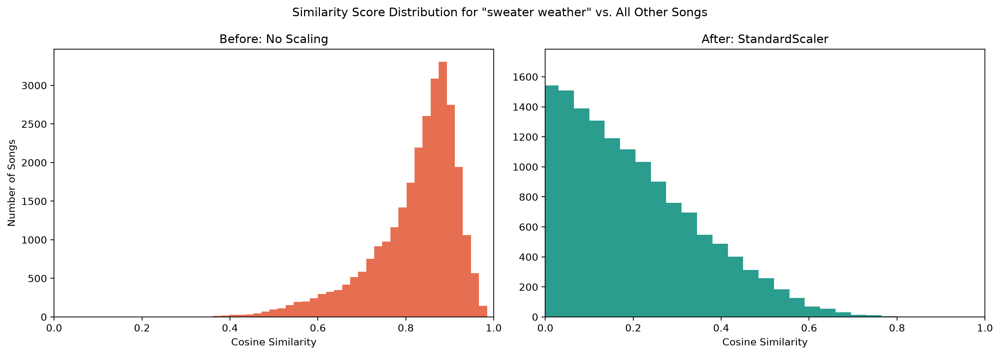

# Content-Based Music Recommender: What Feature Scaling Taught Me About Cosine Similarity

## Overview
For each input song this system recommends *N* similar songs from the 28,372 songs in the dataset based on the cosine similarity between feature vectors (comprising 16 lyrical thematic scores, 6 audio features, 22 dimensions in total). In addition to building the model the main focus of the project has been to examine the impact of various data normalization methods on the quality of the recommendations

## Dataset
The dataset used [tcc_ceds_music.csv](https://www.kaggle.com/datasets/saurabhshahane/music-dataset-1950-to-2019) contains 28,372 songs released between 1950 and 2019. In addition to basic information (artist name, title, genre, release year), each song has 16 lyrical theme score columns (such as dating, violence, romantic), 6 extracted audio features (such as danceability, energy, valence)

## Key Finding
The initial experiment, run without any explicit scaling, produced
similarity scores that were all nearly identical (e.g., 0.979–0.985),
meaning the model could not meaningfully distinguish between songs.
Explicitly applying `MinMaxScaler` barely improved this. Suspecting
high dimensionality as the cause, PCA was tested next — but this made
things worse for some song pairs, with one pair's score rising to
0.972.

Unlike the MinMaxScaler issue, this wasn't a uniform effect — most
similarity scores remained reasonably spread out, and only a handful
of specific pairs were affected. Inspecting the PCA component loadings
showed why: the first principal component was dominated almost
entirely by `acousticness`, `energy`, and `valence`, while the 16
lyrical-topic features contributed very little — meaning PCA was
compressing the space around a mostly audio-driven axis.

To confirm this, we compared the cosine similarity of one high-scoring
pair using only the 15 retained components versus only the 7 discarded
ones. Similarity on the discarded components wasn't just lower — it
was negative (-0.174 vs. 0.972), meaning those components actively
pointed in opposite directions. This indicates the discarded
components held real discriminating signal, most likely lyrical, that
PCA dropped simply because it had low overall variance — not because
it was unimportant for distinguishing this particular pair.

Switching to `StandardScaler` — applied directly to the full feature
set, without any dimensionality reduction — resolved this. It allowed
vectors to point in genuinely different directions, and similarity
scores spread out into a much more meaningful range, producing clearly
better differentiation between dissimilar songs.


*Distribution of cosine similarity between "Sweater Weather" and the 
other 28,371 songs in the dataset — before and after StandardScaler.*


## Tech Stack
- numpy
- pandas
- matplotlib
- seaborn
- scikit-learn
- jupyterlab

## How to Run
1. Clone the repository:
```bash
git clone https://github.com/Ali-reza-rn/content-based-music-recommender.git
cd content-based-music-recommender
```

2. Install dependencies:
```bash
pip install -r requirements.txt
```

3. Download the dataset from [Kaggle](https://www.kaggle.com/datasets/saurabhshahane/music-dataset-1950-to-2019) and place `tcc_ceds_music.csv` in the project root.

4. Launch the notebook:
```bash
jupyter lab music-recommendation.ipynb
```

## Example Output
```python
recommendations = get_recommendations("sweater weather", data, features_Standard_scaled, 10)
```

| track_name       | artist_name            | genre   | similarity |
|------------------|-------------------------|---------|------------|
| tabloid junkie   | michael jackson         | pop     | 0.800      |
| keep on          | the green               | reggae  | 0.780      |
| breathe          | blu cantrell            | pop     | 0.774      |
| outrage! is now  | death from above 1979   | blues   | 0.770      |
| skin & bones     | eli young band          | country | 0.765      |

## Limitations & Future Work
**Known limitations:**
- `genre` was not included in the feature vector (see Feature
  Selection) so recommendations are based purely on audio and
  lyrical similarity and can freely cross genre boundaries — e.g.,
  recommendations for "Sweater Weather" (indie pop) include reggae,
  blues, and country tracks. This is expected given the current
  feature set not a bug but may matter depending on the use case.

**Possible next steps:**
- Apply separate weighting to lyrical vs. audio features, rather
  than treating all 22 dimensions equally.
- Deploy the model as a simple web app (e.g., with Streamlit).
